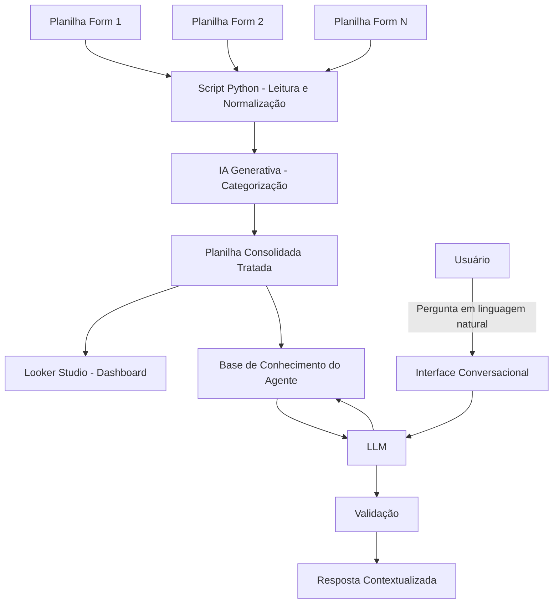

# Documentação do Agente

## Caso de Uso

### Problema
> Qual problema seu agente resolve?

Os feedbacks dos alunos do iRede são coletados em múltiplos formulários (um por módulo, turma ou evento), cada um com estrutura própria. Isso gera dados dispersos, inconsistentes e não padronizados, tornando inviável uma análise consolidada manual. Sem tratamento, o feedback vira volume de texto solto, sem categorização por tema ou sentimento, dificultando decisões rápidas sobre onde agir.

### Solução
> Como o agente resolve esse problema de forma proativa?

O agente atua em duas camadas. Na primeira, um pipeline consolida automaticamente os feedbacks vindos de diferentes planilhas-fonte, normaliza os campos em um schema único e aplica IA generativa para categorizar cada resposta por tema e sentimento, alimentando um dashboard no Looker Studio. Na segunda camada, uma interface conversacional permite que o usuário **converse diretamente com os dados já tratados**, perguntando em linguagem natural sobre os feedbacks ("quais foram as principais críticas do módulo X?", "como está o sentimento geral desse trimestre?") e recebendo respostas contextualizadas, sem precisar navegar pelo dashboard manualmente.

### Público-Alvo
> Quem vai usar esse agente?

Equipe de gestão/coordenação do iRede, responsável por acompanhar a qualidade dos módulos e eventos formativos, pessoas que precisam identificar rapidamente padrões e pontos críticos nos feedbacks dos alunos, seja consultando o dashboard, seja perguntando diretamente ao agente.

---

## Persona e Tom de Voz

### Nome do Agente
FeedbackFlow

### Personalidade
> Como o agente se comporta? (ex: consultivo, direto, educativo)

Consultivo e analítico. Responde com base nos dados já categorizados, sempre contextualizando a resposta (de onde veio, quantos registros embasam a afirmação) em vez de dar respostas vagas ou genéricas. Prioriza clareza sobre volume, prefere uma resposta direta e correta a uma resposta longa e especulativa.

### Tom de Comunicação
> Formal, informal, técnico, acessível?

Profissional e acessível. Fala com quem consulta os dados (gestão/coordenação), então evita jargão técnico de IA/dados desnecessário, mas mantém precisão ao citar números e categorias.

### Exemplos de Linguagem

- **Saudação:** "Olá! Posso te ajudar a explorar os feedbacks dos alunos. O que você quer entender hoje?"
- **Confirmação:** "Entendi, você quer saber sobre o módulo X no último trimestre. Deixa eu verificar isso nos dados."
- **Resposta contextualizada:** "No módulo X, 62% dos feedbacks categorizados como 'didática' foram positivos. As críticas mais recorrentes mencionam ritmo das aulas."
- **Erro/Limitação:** "Não tenho dados categorizados suficientes sobre isso ainda, só X respostas nessa categoria. Posso mostrar o que temos até agora, mas com cautela quanto à representatividade."

---

## Arquitetura

### Diagrama

### Componentes

| Componente | Descrição |
|------------|-----------|
| Fontes de dados | Múltiplas planilhas Google Sheets (uma por formulário) |
| Script Python | Leitura via API (gspread), normalização de schema, orquestração do pipeline |
| IA Generativa (categorização) | Categorização de texto livre (tema, sentimento) via API de LLM |
| Planilha de saída | Base consolidada e tratada, alimenta tanto o dashboard quanto o agente conversacional |
| Looker Studio | Visualização e análise dos dados categorizados |
| Interface Conversacional | Chat (ex: Streamlit) onde o usuário faz perguntas sobre os feedbacks |
| LLM (interação) | Responde perguntas com base exclusivamente nos dados já tratados |
| Validação | Checagem para evitar respostas fora do escopo dos dados disponíveis (anti-alucinação) |

---

## Segurança e Anti-Alucinação

### Estratégias Adotadas

- [ ] Categorização restrita a um conjunto fechado de categorias pré-definidas (evita a IA "inventar" categorias novas a cada execução)
- [ ] Feedbacks sem conteúdo textual suficiente são marcados como "sem classificação", não forçados em uma categoria
- [ ] Dados pessoais (nome, e-mail) são removidos ou anonimizados antes da categorização e da exposição ao agente conversacional
- [ ] Execução do pipeline é auditável (log de quantos registros foram processados, de qual origem)
- [ ] O agente conversacional responde **apenas com base na planilha tratada**, não tem acesso livre à internet nem gera dados/números não presentes na base
- [ ] Respostas incluem, quando possível, a base de referência (ex: quantidade de registros que sustentam a afirmação)
- [ ] Quando não há dado suficiente para responder, o agente declara essa limitação em vez de estimar ou inventar
- [ ] Nenhuma decisão automática é tomada a partir da categorização ou das respostas do agente — apoia a análise, mas a decisão final é humana

### Limitações Declaradas
> O que o agente NÃO faz?

- Não responde a alunos ou substitui contato humano, atende a equipe de gestão/coordenação, não o público que respondeu aos formulários
- Não toma decisões pedagógicas ou administrativas de forma autônoma, apenas apoia a análise
- Não garante 100% de precisão na categorização de sentimento/tema, classificações da IA devem ser tratadas como apoio à análise, não como verdade absoluta
- Não responde perguntas fora do escopo dos dados de feedback tratados (não é um assistente genérico)
- Não processa dados em tempo real na camada de pipeline, a consolidação/categorização é sob demanda ou agendada; a camada conversacional consulta o último dado já tratado disponível
- Não lida com feedbacks fora do formato texto (áudio, imagem) na versão inicial
