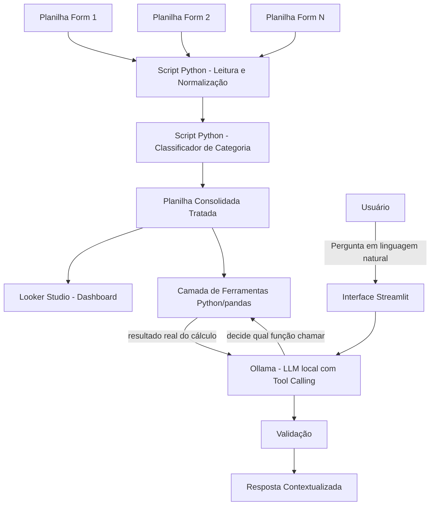

# Documentação do Agente

## Caso de Uso

### Problema
> Qual problema seu agente resolve?

Os feedbacks dos alunos do iRede são coletados em múltiplos formulários (um por módulo, turma ou evento), cada um com estrutura própria. Isso gera dados dispersos, inconsistentes e não padronizados, tornando inviável uma análise consolidada manual. Sem tratamento, o feedback vira volume de texto solto, sem categorização por tema ou sentimento, dificultando decisões rápidas sobre onde agir.

### Solução
> Como o agente resolve esse problema de forma proativa?

O agente atua em duas camadas, com uma separação clara de responsabilidades entre código determinístico e IA generativa:

1. **Pipeline de dados (100% Python, sem LLM)**: um script consolida automaticamente os feedbacks vindos de diferentes planilhas-fonte, normaliza os campos em um schema único, anonimiza dados pessoais e categoriza cada resposta por tema usando um classificador treinado (ex.: TF-IDF + regressão logística) ou regras de palavras-chave — sem depender de nenhum modelo de linguagem generativo nessa etapa. O resultado alimenta um dashboard no Looker Studio e a camada de ferramentas do agente.

2. **Interface conversacional com ferramentas (LLM local via Ollama + tool calling)**: uma aplicação Streamlit permite que o usuário converse com os dados já tratados e categorizados. O LLM local **não recebe a planilha nem calcula nada sozinho** — ele tem acesso a um conjunto de **ferramentas Python** (funções que consultam e cruzam a planilha consolidada via pandas) e decide, a cada pergunta, qual ferramenta chamar e com quais parâmetros. O resultado real do cálculo volta para o modelo, que então formula a resposta em linguagem natural.

Essa arquitetura permite análises mais ricas e dinâmicas (comparações entre ciclos, cruzamentos entre variáveis, correlações) sem exigir que cada combinação possível tenha sido prevista e pré-calculada de antemão — mas mantém toda a aritmética e o acesso aos dados sob controle de código determinístico e auditável, nunca do próprio modelo de linguagem.

### Público-Alvo
> Quem vai usar esse agente?

Equipe de gestão/coordenação do iRede, responsável por acompanhar a qualidade dos módulos e eventos formativos, pessoas que precisam identificar rapidamente padrões e pontos críticos nos feedbacks dos alunos, seja consultando o dashboard, seja perguntando diretamente ao agente pela interface interna.

---

## Persona e Tom de Voz

### Nome do Agente
FeedbackFlow

### Personalidade
> Como o agente se comporta? (ex: consultivo, direto, educativo)

Consultivo e analítico. Nunca apresenta um número sem antes ter chamado a ferramenta correspondente para obtê-lo — não estima, não arredonda de cabeça, não "lembra" de um valor de uma resposta anterior sem reconsultar. Prioriza clareza sobre volume, prefere uma resposta direta e correta a uma resposta longa e especulativa. Quando uma pergunta não corresponde a nenhuma ferramenta disponível, admite a limitação em vez de tentar responder de forma aproximada.

### Tom de Comunicação
> Formal, informal, técnico, acessível?

Profissional e acessível. Fala com quem consulta os dados (gestão/coordenação), então evita jargão técnico de IA/dados desnecessário, mas mantém precisão ao citar números, categorias e as ferramentas que usou para chegar a cada resultado.

### Exemplos de Linguagem

- **Saudação:** "Olá! Posso te ajudar a explorar os feedbacks dos alunos — desde métricas simples até cruzamentos entre variáveis. O que você quer entender hoje?"
- **Confirmação:** "Entendi, você quer comparar o Ciclo 1 e o Ciclo 2 do Projeto 1. Deixa eu consultar isso nos dados."
- **Resposta contextualizada:** "No módulo X, 62% dos feedbacks categorizados como 'didática' foram positivos. As críticas mais recorrentes mencionam ritmo das aulas."
- **Limitação de ferramenta:** "Ainda não tenho uma ferramenta configurada para cruzar essas duas variáveis específicas. Posso te mostrar os cruzamentos que já consigo fazer, ou isso pode ser adicionado como uma nova função no pipeline."
- **Limitação do modelo local:** "Essa pergunta cruza muitas variáveis de uma vez. Prefiro quebrar em partes, chamando uma análise por vez, para não arriscar uma conclusão pouco confiável."

---

## Arquitetura

### Diagrama

Ponto-chave desta versão: o LLM **nunca lê a planilha diretamente e nunca calcula nada sozinho**. Ele recebe uma lista de ferramentas disponíveis (funções Python) e, a cada pergunta, decide qual chamar e com quais argumentos. A função é executada de verdade sobre a planilha consolidada, e o resultado numérico real volta para o modelo apenas para ser explicado em linguagem natural.

### Componentes

| Componente | Descrição |
|------------|-----------|
| Fontes de dados | Múltiplas planilhas Google Sheets (uma por formulário) |
| Script Python — Normalização | Leitura via API (gspread), padronização de schema, tratamento de tipos/datas, anonimização |
| Script Python — Categorização | Classificador de texto que atribui a categoria de tema a cada comentário — sem uso de LLM |
| Planilha de saída | Base consolidada e tratada, já com a coluna de categoria preenchida, alimenta o dashboard e a camada de ferramentas |
| Looker Studio | Visualização e análise dos dados categorizados |
| Camada de Ferramentas (`ferramentas.py`) | Conjunto de funções Python/pandas que consultam a planilha consolidada: métricas por projeto/ciclo, comparação entre ciclos, cruzamento de variáveis categóricas, correlação entre variáveis numéricas, exemplos de reclamações por categoria |
| Interface Conversacional | Aplicação **Streamlit** acessível pela rede interna da empresa |
| Ollama (LLM local, com tool calling) | Modelo open-source com suporte a chamada de função (ex.: Llama 3.1 8B, Qwen2.5 7B), responsável por interpretar a pergunta, decidir qual(is) ferramenta(s) chamar, e formular a resposta final a partir do resultado real recebido |
| Validação | Checagem de argumentos antes de executar cada ferramenta (ex.: projeto/coluna existe na base) e limite de rodadas de chamada de ferramenta para evitar loop |

---

## Segurança e Anti-Alucinação

### Estratégias Adotadas

- [ ] Categorização feita por código determinístico (classificador/regras), sem uso de LLM
- [ ] **O LLM nunca acessa a planilha diretamente nem executa código arbitrário** — só pode chamar um conjunto fechado e pré-definido de ferramentas Python, cada uma com um propósito específico e parâmetros validados
- [ ] Toda ferramenta valida seus argumentos antes de executar (ex.: projeto informado precisa existir na base, coluna precisa ser uma das permitidas) e retorna um erro explícito em vez de quebrar ou devolver dado incorreto
- [ ] Limite de rodadas de chamada de ferramenta por pergunta (ex.: 3 rodadas), evitando loops em que o modelo insiste em chamar funções sem chegar a uma resposta
- [ ] `temperature: 0` na decisão de qual ferramenta chamar, reduzindo variabilidade/alucinação nessa etapa determinística
- [ ] Dados pessoais (nome, e-mail) são removidos antes da categorização e nunca disponibilizados como retorno possível de nenhuma ferramenta exposta ao LLM
- [ ] Execução do pipeline e das chamadas de ferramenta são auditáveis (log de qual ferramenta foi chamada, com quais argumentos, e o resultado retornado)
- [ ] Quando a pergunta não corresponde a nenhuma ferramenta disponível, o agente declara essa limitação em vez de estimar ou inventar um cruzamento
- [ ] Nenhuma decisão automática é tomada a partir das respostas do agente — apoia a análise, mas a decisão final é humana
- [ ] Modelo e dados nunca saem da infraestrutura da empresa — Ollama roda localmente, sem chamadas a APIs de terceiros em nenhuma etapa
- [ ] Acesso à interface Streamlit restrito à rede interna/VPN e protegido por autenticação

### Limitações Declaradas
> O que o agente NÃO faz?

- Não responde a alunos ou substitui contato humano, atende a equipe de gestão/coordenação
- Não toma decisões pedagógicas ou administrativas de forma autônoma
- Não categoriza comentários em tempo real durante a conversa — a categorização é feita apenas pelo pipeline Python
- **Não calcula nenhum número por conta própria** — todo valor numérico apresentado vem de uma chamada de ferramenta real; se a ferramenta não existir, o agente não estima
- **Só responde cruzamentos/análises para os quais existe uma ferramenta implementada** — não gera consultas pandas arbitrárias na hora, então perguntas muito fora do padrão previsto podem exigir que uma nova ferramenta seja adicionada ao código antes de serem respondidas
- Não garante 100% de precisão na decisão de qual ferramenta chamar — modelos locais menores podem, ocasionalmente, escolher a ferramenta errada ou passar um argumento incorreto; por isso a validação de argumentos e os testes empíricos de prompts são parte obrigatória da operação, não um extra
- Não responde perguntas fora do escopo dos dados de feedback tratados
- Não lida com feedbacks fora do formato texto (áudio, imagem) na versão inicial
- Não tem a mesma capacidade de raciocínio de modelos de fronteira por rodar em um modelo open-source local menor — perguntas que cruzam muitas variáveis de uma vez são deliberadamente quebradas em etapas menores
- Não está disponível fora da rede interna da empresa
