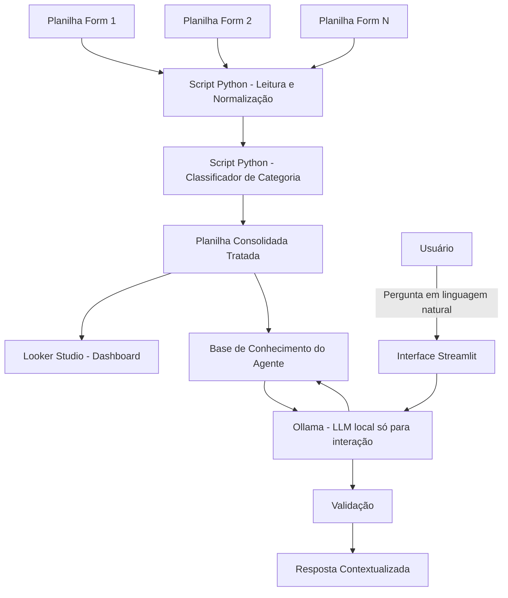

# Documentação do Agente

## Caso de Uso

### Problema
> Qual problema seu agente resolve?

Os feedbacks dos alunos do iRede são coletados em múltiplos formulários (um por módulo, turma ou evento), cada um com estrutura própria. Isso gera dados dispersos, inconsistentes e não padronizados, tornando inviável uma análise consolidada manual. Sem tratamento, o feedback vira volume de texto solto, sem categorização por tema ou sentimento, dificultando decisões rápidas sobre onde agir.

### Solução
> Como o agente resolve esse problema de forma proativa?

O agente atua em duas camadas, com uma separação clara de responsabilidades entre código determinístico e IA generativa:

1. **Pipeline de dados (100% Python, sem LLM)**: um script consolida automaticamente os feedbacks vindos de diferentes planilhas-fonte, normaliza os campos em um schema único, anonimiza dados pessoais e **categoriza cada resposta por tema** usando um classificador treinado (ex.: TF-IDF + regressão logística) ou regras de palavras-chave — sem depender de nenhum modelo de linguagem generativo nessa etapa. O resultado alimenta um dashboard no Looker Studio e a base de conhecimento do agente.

2. **Interface conversacional (LLM local via Ollama)**: uma aplicação Streamlit permite que o usuário converse com os dados **já tratados e categorizados**, perguntando em linguagem natural ("quais foram as principais críticas do módulo X?", "como está o sentimento geral desse trimestre?"). Aqui, o LLM local **não categoriza nada** — ele apenas interpreta a pergunta, busca o recorte certo nos dados já processados pelo Python, e formula a resposta em linguagem natural.

Essa separação é intencional: tarefas determinísticas e repetíveis (normalização, categorização, cálculo de médias) ficam em código Python, que é mais rápido, mais barato, 100% auditável e não tem risco de alucinação. O LLM entra só onde o problema realmente exige linguagem natural — entender a pergunta do usuário e explicar o resultado de forma legível.

### Público-Alvo
> Quem vai usar esse agente?

Equipe de gestão/coordenação do iRede, responsável por acompanhar a qualidade dos módulos e eventos formativos, pessoas que precisam identificar rapidamente padrões e pontos críticos nos feedbacks dos alunos, seja consultando o dashboard, seja perguntando diretamente ao agente pela interface interna.

---

## Persona e Tom de Voz

### Nome do Agente
FeedbackFlow

### Personalidade
> Como o agente se comporta? (ex: consultivo, direto, educativo)

Consultivo e analítico. Responde com base nos dados já categorizados pelo pipeline Python, sempre contextualizando a resposta (de onde veio, quantos registros embasam a afirmação) em vez de dar respostas vagas ou genéricas. Prioriza clareza sobre volume, prefere uma resposta direta e correta a uma resposta longa e especulativa. Não tenta reclassificar ou reinterpretar a categoria já atribuída pelo pipeline — trabalha em cima do dado tratado como fonte da verdade.

### Tom de Comunicação
> Formal, informal, técnico, acessível?

Profissional e acessível. Fala com quem consulta os dados (gestão/coordenação), então evita jargão técnico de IA/dados desnecessário, mas mantém precisão ao citar números e categorias.

### Exemplos de Linguagem

- **Saudação:** "Olá! Posso te ajudar a explorar os feedbacks dos alunos. O que você quer entender hoje?"
- **Confirmação:** "Entendi, você quer saber sobre o módulo X no último trimestre. Deixa eu verificar isso nos dados."
- **Resposta contextualizada:** "No módulo X, 62% dos feedbacks categorizados como 'didática' foram positivos. As críticas mais recorrentes mencionam ritmo das aulas."
- **Erro/Limitação:** "Não tenho dados categorizados suficientes sobre isso ainda, só X respostas nessa categoria. Posso mostrar o que temos até agora, mas com cautela quanto à representatividade."
- **Pedido de classificação ad hoc:** "Eu não categorizo comentários novos em tempo real — isso é feito pelo pipeline automatizado. Se quiser, posso te mostrar como comentários parecidos com esse foram classificados na base."

---

## Arquitetura

### Diagrama

Ponto-chave desta versão: **o bloco de categorização (E) não usa LLM** — é código Python (classificador treinado ou regras). O Ollama aparece **só** na camada de interação (K), depois que os dados já estão tratados e categorizados. Isso é diferente de uma arquitetura onde a IA generativa categoriza os dados brutos.

### Componentes

| Componente | Descrição |
|------------|-----------|
| Fontes de dados | Múltiplas planilhas Google Sheets (uma por formulário) |
| Script Python — Normalização | Leitura via API (gspread), padronização de schema, tratamento de tipos/datas, anonimização |
| Script Python — Categorização | Classificador de texto (ex.: TF-IDF + Regressão Logística treinado com exemplos rotulados, ou regras de palavras-chave) que atribui a categoria de tema a cada comentário — **sem uso de LLM** |
| Planilha de saída | Base consolidada e tratada, já com a coluna de categoria preenchida, alimenta tanto o dashboard quanto o agente conversacional |
| Looker Studio | Visualização e análise dos dados categorizados |
| Interface Conversacional | Aplicação **Streamlit** acessível pela rede interna da empresa, onde o usuário faz perguntas sobre os feedbacks |
| Ollama (LLM local) | Modelo open-source (ex.: Llama 3.1 8B, Gemma 2 9B) rodando localmente, usado **exclusivamente** para interpretar a pergunta do usuário e formular a resposta em linguagem natural com base nos dados já categorizados — não participa da categorização |
| Validação | Checagem para evitar respostas fora do escopo dos dados disponíveis (anti-alucinação) |

---

## Segurança e Anti-Alucinação

### Estratégias Adotadas

- [ ] Categorização feita por **código determinístico** (classificador/regras), restrita a um conjunto fechado de categorias pré-definidas — não há risco de a IA "inventar" categorias novas, pois nenhum LLM participa dessa etapa
- [ ] Feedbacks sem conteúdo textual suficiente, ou com baixa confiança do classificador, são marcados como "sem classificação", não forçados em uma categoria
- [ ] Dados pessoais (nome, e-mail) são removidos ou anonimizados antes da categorização e antes de qualquer exposição ao LLM de interação
- [ ] Execução do pipeline é auditável (log de quantos registros foram processados, de qual origem, e a confiança do classificador por registro)
- [ ] O LLM de interação responde **apenas com base na planilha já tratada e categorizada**, não tem acesso livre à internet, não gera categorias novas e não recalcula agregações sozinho — médias e contagens são calculadas em Python e passadas prontas ao modelo
- [ ] Respostas incluem, quando possível, a base de referência (ex: quantidade de registros que sustentam a afirmação)
- [ ] Quando não há dado suficiente para responder, o agente declara essa limitação em vez de estimar ou inventar
- [ ] Nenhuma decisão automática é tomada a partir da categorização ou das respostas do agente — apoia a análise, mas a decisão final é humana
- [ ] Modelo e dados nunca saem da infraestrutura da empresa — Ollama roda localmente, sem envio de dados a APIs de terceiros em nenhuma etapa (categorização nem interação)
- [ ] Acesso à interface Streamlit restrito à rede interna/VPN e protegido por autenticação (login corporativo ou `streamlit-authenticator`)

### Limitações Declaradas
> O que o agente NÃO faz?

- Não responde a alunos ou substitui contato humano, atende a equipe de gestão/coordenação, não o público que respondeu aos formulários
- Não toma decisões pedagógicas ou administrativas de forma autônoma, apenas apoia a análise
- **Não categoriza comentários em tempo real durante a conversa** — a categorização é feita apenas pelo pipeline Python, de forma agendada/sob demanda; o LLM de interação só consulta categorias já atribuídas
- Não garante 100% de precisão na categorização (classificador clássico também erra), classificações devem ser tratadas como apoio à análise, não como verdade absoluta
- Não responde perguntas fora do escopo dos dados de feedback tratados (não é um assistente genérico)
- Não processa dados em tempo real na camada de pipeline, a consolidação/categorização é sob demanda ou agendada; a camada conversacional consulta o último dado já tratado disponível
- Não lida com feedbacks fora do formato texto (áudio, imagem) na versão inicial
- Não tem a mesma capacidade de raciocínio de modelos de fronteira (Gemini, Claude, GPT) por rodar em um modelo open-source local menor — perguntas muito complexas ou ambíguas podem receber respostas de qualidade inferior, e o agente é instruído a admitir isso em vez de arriscar uma resposta pouco confiável
